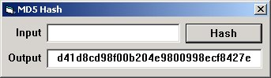



## A MD5 Class

### Description

Provides for very easy, reusable MD5 hashing. Includes example usage.
 
### More Info
 

             |
---                |---
**Submitted On**   |2006-05-21 20:55:16
**By**             |[r\_t](https://github.com/Planet-Source-Code/PSCIndex/blob/master/ByAuthor/r-t.md)
**Level**          |Intermediate
**User Rating**    |4.9 (34 globes from 7 users)
**Compatibility**  |VB 6\.0
**Category**       |[Encryption](https://github.com/Planet-Source-Code/PSCIndex/blob/master/ByCategory/encryption__1-48.md)
**World**          |[Visual Basic](https://github.com/Planet-Source-Code/PSCIndex/blob/master/ByWorld/visual-basic.md)
**Archive File**   |[A\_MD5\_Clas1996085222006\.zip](https://github.com/Planet-Source-Code/r-t-a-md5-class__1-65445/archive/master.zip)

